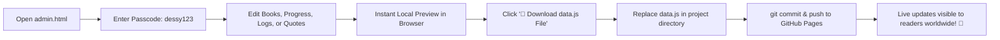

# ✒️ Dessy Ackerman | Storyteller & Dreamer

> **A cozy digital scrapbook archive, interactive author desk, and standalone Owner Ledger CMS.**  
> Crafted with vanilla web technologies (HTML5, CSS3, JavaScript) and the Web Audio API — zero build tools, zero external dependencies, 100% static hosting ready.

---

## 🌟 Overview

**Dessy Ackerman** is an author website built to resemble an antique writing desk and tactile scrapbook journal. It blends nostalgic papercraft aesthetics with modern interactive web features:

- **Tactile Scrapbook Interface:** Styled with realistic wood textures, parchment paper pages, washi tape strips, paperclips, pressed botanical ferns, and subtle coffee stains.
- **Dynamic Single-Page Application (SPA):** Instant tab switching between *Home*, *About*, *Bookshelf*, and *Writing Desk* with smooth page leaf transitions and full browser hash routing (`#home`, `#about`, `#books`, `#desk`).
- **Owner Ledger Admin Studio (`admin.html`):** A private, passcode-protected content management dashboard to create, update, and manage books, progress bars, journal logs, quotes, and store items without touching a single line of code.
- **Embedded Web Audio Synthesizer:** An interactive cozy music box that procedurally generates nostalgic lullaby chimes with floating visual notes.
- **Interactive Companion Mascot:** "Poe the Desk Cat" — an SVG animated cat companion offering writer wisdom and dialogue on click.
- **Ambient Candlelight Mode:** A warm, flickering nighttime desk theme toggled at the click of a match.

---

## 📸 Core Features

### 📖 1. The Scrapbook Journal (Public Site — `index.html`)

| Section | Description |
| :--- | :--- |
| **🏠 Home Archive** | Hero banner greeting, author introduction, interactive desk sticky note, featured book spotlight, and quick navigation bookmarks. |
| **☕ About Dessy** | Author manifesto (*"Why I Write"*), interactive trope tags (*Found Family, Enemies to Lovers, Slow Burn*), favorite genres, collectible hobbies list, fun facts, and writing sanctuary trivia. |
| **📚 The Bookshelf** | 3D interactive hardcover books with custom foil accents and spine highlights. Clicking any volume opens a **Book Scrapbook Modal** featuring synopses, character dossiers, Pinterest moodboards, soundtrack playlists, and purchase links. |
| **🖋️ Writing Desk** | Live Work-in-Progress (WIP) tracker with percentage progress bar and word count tracker, desk journal logs, raw manuscript snippets, deleted scenes, sneak peeks, and an auto-rotating quote carousel. |
| **🕯️ Candlelight Mode** | Ambient night-mode theme with warm lighting glow and cozy color overrides. |
| **🎶 Cozy Music Box** | HTML5 Web Audio API synthesizer with animated winding crank and musical note particle physics. |
| **🐾 Poe the Desk Cat** | Hand-crafted SVG mascot with blinking eyes and interactive speech bubble wisdom. |

---

### 🗝️ 2. Owner Ledger Admin Portal (`admin.html`)

A visual Content Management Studio allowing the author to update every aspect of the website:

1. **Passcode Gatekeeper:** Protected by default (`dessy123`), customizable in settings.
2. **Home & Branding Manager:** Edit site titles, greetings, hero subtitles, sticky note reminders, and social media stamps.
3. **About Page Editor:** Update author manifesto, add/remove tropes, genres, hobbies, fun facts, and location details.
4. **Bookshelf & Manuscript Studio:** Add new book entries, upload custom cover art or choose SVG foil doodles, manage character dossiers, Spotify/soundtrack playlists, and retailer links.
5. **Writing Desk & WIP Tracker:** Update current WIP title, chapter status, progress percentage (0–100%), word count goals, desk logs, manuscript scraps, and preview extras.
6. **Quote & Wisdom Carousel:** Add, edit, or curate desk quotes with instant live attribution.
7. **Mascot Speech Customizer:** Add new cat dialogues and greeting messages for Poe.
8. **Boutique & Merchandise Catalog:** Manage signed hardcover editions, sticker packs, pricing, and purchase URLs.
9. **Export & Live Publishing:** 
   - Instant live preview saved to browser `localStorage`.
   - **1-Click Download (`data.js`)** to permanently commit updates to GitHub Pages or web hosting.
   - **JSON Backup & Restore:** Import backups or reset to factory defaults anytime.

---

## 🗂️ Project Structure

```text
My-website/
├── index.html          # Public website (Scrapbook Journal SPA)
├── admin.html          # Owner Ledger (Private Content Management Studio)
├── styles.css          # Master stylesheet (CSS variables, scrapbook layout, animations)
├── app.js              # Public SPA router, renderers, audio synth, and modal logic
├── admin.js            # Admin studio logic, forms, editors, state persistence & export
├── data.js             # Master data archive (books, WIPs, quotes, settings, defaults)
├── assets/             # Book covers, art assets, and illustrations
│   └── our-hundred-days.jpg
└── README.md           # Documentation and guides
```

---

## 🚀 Getting Started

### Running Locally

Because this project uses standard web technologies without external build tools or bundlers, you can run it immediately in any web browser.

#### Option A: Direct Open (Simplest)
Double-click `index.html` (or `admin.html`) in your file explorer to open it directly in your browser.

#### Option B: Local Web Server (Recommended)
Running through a local web server enables optimal asset loading and URL navigation:

**Using VS Code:**
- Install the **Live Server** extension.
- Right-click `index.html` → **Open with Live Server**.

**Using Python (Terminal):**
```bash
# Python 3.x
python3 -m http.server 8000
```
Open `http://localhost:8000` in your browser.

**Using Node.js:**
```bash
npx serve .
```

---

## 🛠️ How Content Management Works



### Publishing Workflow:
1. Navigate to `admin.html` and enter your passcode (`dessy123`).
2. Make your edits in the dashboard (e.g., update word count, add a new desk log, or add a book).
3. Switch to the **Export & Backup** tab (`Tab 8`).
4. Click **💾 Download data.js File**.
5. Move the downloaded `data.js` into your project root (replacing the previous `data.js`).
6. Push the commit to your git repository:
   ```bash
   git add data.js
   git commit -m "Update website content from Owner Ledger"
   git push origin main
   ```

---

## 🎨 Design System & Customization

All styling is managed in [`styles.css`](styles.css) using CSS Custom Properties (Variables):

```css
:root {
  /* Palette */
  --color-desk-wood: #7f5836;
  --color-desk-wood-dark: #443025;
  --color-parchment: #faf6ee;
  --color-parchment-accent: #f4ede8;
  --color-parchment-aged: #e1d4cc;
  --color-ink: #443025;
  --color-ink-faded: #695246;
  --color-ink-light: #8c7365;

  /* Accents */
  --color-sage: #aa7f66;
  --color-rose: #ec9c9d;
  --color-gold: #f2cf2a;
  --color-candle-glow: rgba(242, 207, 42, 0.2);

  /* Typography */
  --font-serif: 'Lora', 'Georgia', serif;
  --font-heading: 'Playfair Display', 'Times New Roman', serif;
  --font-handwritten: 'Caveat', cursive;
}
```

### Google Fonts Used:
- **Playfair Display**: Dramatic serif for chapter titles and header banners.
- **Lora**: Elegant body serif for synopses, letters, and excerpts.
- **Caveat**: Expressive cursive script for handwritten sticky notes, author signatures, and scrapbook captions.

---

## 🌐 Free Deployment (GitHub Pages)

Deploy your website in under 2 minutes:

1. Push this repository to GitHub.
2. In your repository on GitHub, navigate to **Settings** → **Pages**.
3. Under **Build and deployment** → **Source**, select `Deploy from a branch`.
4. Under **Branch**, select `main` / `root` and click **Save**.
5. Your website will be live at `https://<your-username>.github.io/<repo-name>/`!

---

## 📱 Responsive & Accessible Design

- **Mobile First Navigation:** Automatically adapts to mobile screens with a vintage book-styled popup drawer.
- **Semantic HTML5 & WAI-ARIA:** Fully labeled navigation buttons, modal dialogs with escape key handling, accessible SVGs, and screen reader live regions.
- **Fast Load Times:** Zero external JavaScript frameworks, minimal payload, and instant asset caching.

---

## 📄 License & Credits

Created with ❤️ for **Dessy Ackerman**.  
All design elements, original vector sketches, and custom styles are open for personalization.
